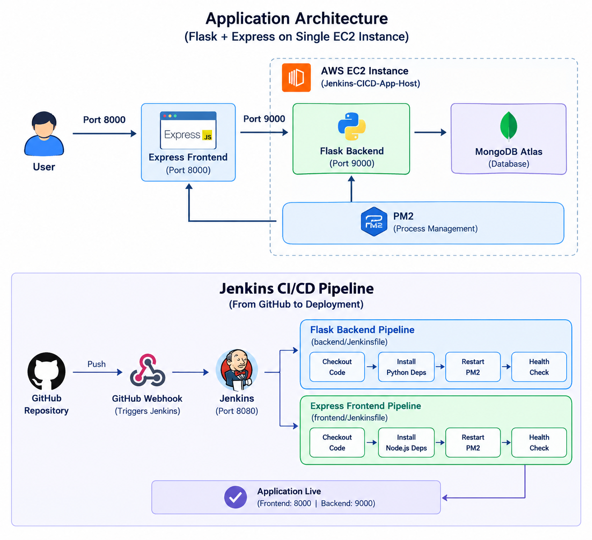

# Flask + Express Deployment with Jenkins CI/CD

## Project Overview

This project deploys a Flask backend and Express frontend on a single AWS EC2 instance.

Jenkins is used to automate the CI/CD process. Separate Jenkins pipelines are configured for the Flask backend and Express frontend.

The applications are managed using PM2 and the backend connects to MongoDB Atlas.

---

## Architecture



### Architecture Flow

1. User accesses the application through port **8000**.
2. Express frontend runs on port **8000**.
3. Express communicates with the Flask backend on port **9000**.
4. Flask backend communicates with **MongoDB Atlas**.
5. PM2 manages both application processes.
6. Jenkins automatically builds and deploys the applications from GitHub.

---

# Part 1: Deploy Flask and Express on a Single EC2 Instance

## EC2 Instance

The application is deployed on a single AWS EC2 instance.

### EC2 Configuration

- EC2 Instance: `Jenkins-CICD-App-Host`
- Operating System: Ubuntu
- Region: AWS Mumbai (`ap-south-1`)
- SSH access configured
- Python 3 installed
- Node.js installed
- Git installed
- Java 21 installed
- PM2 installed

---

## Application Setup

The project is maintained in a monorepo containing both applications.

### Flask Backend

The Flask backend is configured with a Python virtual environment.

Dependencies are installed using:

```bash
pip install -r requirements.txt
```

The Flask backend runs internally on:

```text
Port 9000
```

Port 9000 is not publicly exposed through the Security Group.

---

### Express Frontend

The Express frontend dependencies are installed using:

```bash
npm install
```

The frontend runs on:

```text
Port 8000
```

Port 8000 is publicly accessible through the EC2 Security Group.

---

## Process Management with PM2

PM2 is used to keep both applications running and restart them when required.

The running processes can be checked using:

```bash
pm2 list
```

Expected applications:

```text
flask-backend
express-frontend
```

PM2 also keeps the applications running after process or server restarts.

---

# Part 2: Jenkins CI/CD Pipeline

## Jenkins Installation

Jenkins is installed and configured on the EC2 environment.

Jenkins is running as a system service.

The Jenkins interface is available on:

```text
Port 8080
```

---

## Jenkins Tools and Plugins

The required Jenkins tools and plugins have been configured.

Configured tools include:

- Git
- NodeJS
- Pipeline
- Jenkins Pipeline support

---

# Separate Jenkins Pipelines

Two separate Jenkins pipelines are configured.

## 1. Flask Backend Pipeline

Pipeline name:

```text
flask-backend-pipeline
```

The pipeline performs the following steps:

1. Checkout the latest source code.
2. Install Python dependencies.
3. Configure the Flask backend.
4. Restart the Flask application using PM2.
5. Perform a health check.

Jenkinsfile location:

```text
backend/Jenkinsfile
```

---

## 2. Express Frontend Pipeline

Pipeline name:

```text
express-frontend-pipeline
```

The pipeline performs the following steps:

1. Checkout the latest source code.
2. Install Node.js dependencies.
3. Restart the Express frontend using PM2.
4. Perform a health check.

Jenkinsfile location:

```text
frontend/Jenkinsfile
```

---

# GitHub Webhook

A GitHub webhook is configured to trigger Jenkins when new code is pushed to the repository.

Webhook endpoint:

```text
http://<EC2-PUBLIC-IP>:8080/github-webhook/
```

The webhook allows the Jenkins pipelines to automatically start after a GitHub push.

---

# CI/CD Flow

```text
Developer
    |
    v
GitHub Repository
    |
    | Push
    v
GitHub Webhook
    |
    v
Jenkins
    |
    +----------------------+
    |                      |
    v                      v
Backend Pipeline      Frontend Pipeline
    |                      |
    v                      v
Install Dependencies   npm install
    |                      |
    v                      v
PM2 Restart            PM2 Restart
    |                      |
    +----------+-----------+
               |
               v
          Health Check
               |
               v
        Application Live
```

---

# Security Group Configuration

The EC2 Security Group is configured with the required ports.

| Port | Purpose          | Access        |
| ---- | ---------------- | ------------- |
| 22   | SSH              | Open          |
| 8080 | Jenkins          | Open          |
| 8000 | Express Frontend | Open          |
| 9000 | Flask Backend    | Internal only |

Port **9000 is not publicly exposed**. The backend is accessed internally by the frontend.

---

# Application Access

## Frontend

The Express frontend is accessible through:

```text
http://13.203.220.158:8000/
```

## Backend

The Flask backend runs internally on:

```text
curl http://localhost:9000/
```

It is not directly exposed to the public internet.

---

# Evidence Documentation

All project evidence and screenshots have been compiled in a separate document.

The document contains screenshots and evidence for:

- AWS EC2 and Security Group configuration
- Jenkins installation and pipelines
- Jenkins successful build history
- PM2 running processes
- Live frontend application
- Application and deployment configuration

The complete evidence document has been prepared as a **Google Doc** and exported as a **PDF**.

The PDF evidence document has also been shared on the GitHub repository along with this project.

**Note:** All screenshots and supporting evidence are available in the separate PDF evidence document.&#x20;

---

# Project Status

| Component                  | Status                    |
| -------------------------- | ------------------------- |
| AWS EC2 Instance           | Completed                 |
| SSH Configuration          | Completed                 |
| Python Installation        | Completed                 |
| Node.js Installation       | Completed                 |
| Git Installation           | Completed                 |
| Java 21 Installation       | Completed                 |
| Flask Backend Setup        | Completed                 |
| Express Frontend Setup     | Completed                 |
| PM2 Process Management     | Completed                 |
| Jenkins Installation       | Completed                 |
| Backend Jenkins Pipeline   | Completed                 |
| Frontend Jenkins Pipeline  | Completed                 |
| GitHub Webhook             | Configured                |
| CI/CD Pipeline Testing     | Completed                 |
| Architecture Documentation | Completed                 |
| Evidence Documentation     | Available in separate PDF |

---

# Conclusion

The Flask backend and Express frontend are deployed on a single AWS EC2 instance.

Jenkins provides separate CI/CD pipelines for both applications. PM2 manages the application processes, while MongoDB Atlas is used as the database.

The deployment is accessible through the Express frontend on port 8000, while the Flask backend runs internally on port 9000.

The project is ready for final submission. All supporting screenshots and evidence are available in the separate PDF evidence document shared on the GitHub repository.
